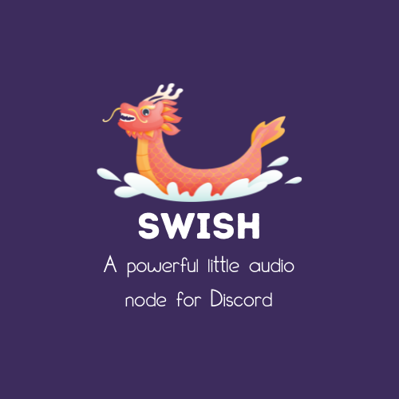

## Swish - The powerful little audio node for Discord.

Swish is a standalone server that allows you to connect multiple bots and play audio
across all your guilds/servers. With built-in YouTube, SoundCloud, ++ searching, IP Rotation,
and more, with more being actively developed.

~~Swish is currently **EARLY ALPHA** and should be used only by developers wishing to contribute either by code or by valuable feedback.~~
Honestly you shouldn't use this unless you're developing it.